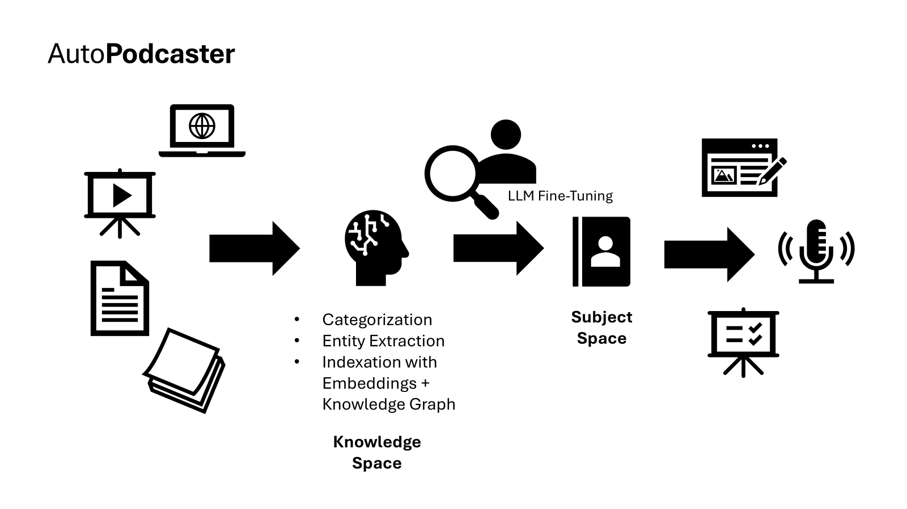

# AutoPodcaster

	

AutoPodcaster is an innovative application designed to streamline the process of staying informed. It aggregates a vast array of content, including website links, PDFs, videos, and audio files. The application then categorizes and organizes this content into a graph structure, making it easy to navigate and explore. This is called the `knowledge space`.

When the user wants to learn more about a specific topic, they can create a `subject space` within the application. The subject space is a curated collection of content related to the chosen topic. Output generators within the application can then create various outputs based on the subject space. For example, the application can generate a podcast, blog post, or presentation on the chosen topic.
 


AutoPodcaster leverages cutting-edge technologies such as Azure AI Search, Azure OpenAI, and multi-agent framework like Autogen to provide a seamless and efficient user experience. By automating the process of content aggregation, categorization, and output generation, AutoPodcaster enables users to stay informed and up-to-date on a wide range of topics without the need to use a notebook, categorize the content, and generate the output. It could be completely automated. We call this project a `ui-less` solution for information consumption.

AutoPodcaster was originally created by Pierre Malarme and Jorge Garcia Ximenez. It takes its current shape during Microsoft Global Hackathon 2024 by a team of passionate hackers who are committed to making information more accessible and easier to consume. It wins the local Belgium venue and is now open-sourced for the community to use, contribute and improve. A big thank you to the team and to Mateo Echeverry Hoyos for the support cleaning this repository before publication

[](https://github.com/pmalarme)
[](https://github.com/gxjorge)
[](https://github.com/cedricve)
[](https://github.com/bjcmit)
[](https://github.com/ivana61)
[](https://github.com/rdesutter)
[](https://github.com/KarolGel)
[](https://github.com/mateo762)

## Current state

Currently, there are some limitations to AutoPodcaster:
* The application is not fully functional and requires additional development to support all features.
* The graph structure is not implemented. The content is fetched using RAG and Azure AI Search.
* The extraction of entities and categories is not implemented yet.
* Only podcast generation is implemented.
* The generation of podcast using agentic framework is implemented currently only in Jupyter Notebook [outline_segment_.ipynb](notebooks/outline_segment_.ipynb).
* The subject space should be only a filter on the knowledge space when using RAG instead of creating each time a new index.

## Prerequisites

Before you begin, ensure you have the following tools and services installed:

- [Python 3.11+](https://www.python.org/downloads/)
- [Node.js](https://nodejs.org/en/download/)
- [Azure CLI](https://docs.microsoft.com/en-us/cli/azure/install-azure-cli)
- [Docker](https://www.docker.com/products/docker-desktop)
- [FastAPI](https://fastapi.tiangolo.com/)
- [Azure Storage Account](https://docs.microsoft.com/en-us/azure/storage/common/storage-account-create?tabs=azure-portal)
- [Azure Service Bus](https://docs.microsoft.com/en-us/azure/service-bus-messaging/service-bus-create-namespace-portal)
- [Azure Cosmos DB](https://docs.microsoft.com/en-us/azure/cosmos-db/create-sql-api-python)
- [Azure Search](https://docs.microsoft.com/en-us/azure/search/search-create-service-portal)
- [Azure Speech](https://docs.microsoft.com/en-us/azure/cognitive-services/speech-service/overview)

## Deploying to Azure

1. Navigate to the `infra` directory:

    ```bash
    cd infra
    ```

2. Run the deployment script:

    ```bash
    . deploy.sh
    ```

This script sets up the necessary Azure resources, including the Service Bus, Cosmos DB, and storage account.

## Setting Up Environment Variables

Create a `.env` file in the root directory of the project and add the following environment variables:

```plaintext
OPENAI_API_KEY=
OPENAI_AZURE_ENDPOINT=
OPENAI_AZURE_DEPLOYMENT=
OPENAI_API_VERSION=
OPENAI_AZURE_DEPLOYMENT_EMBEDDINGS=
AZURE_SPEECH_KEY=
AZURE_SPEECH_REGION=
SERVICEBUS_CONNECTION_STRING=
COSMOSDB_CONNECTION_STRING=
STATUS_ENDPOINT=
```

## Running Microservices Locally

### Indexer

The `indexer` is for status management and to create a knowledge space with all the knowledge.

1. Navigate to the `src/indexer` directory:

    ```bash
    cd src/indexer
    ```

2. Install the required dependencies:

    ```bash
    pip install -r requirements.txt
    pip install fastapi[standard]==0.112.0
    ```

3. Run the indexer:

    ```bash
    fastapi dev indexer.py --port 8081
    ```

### Subject Space

The `subject_space` is to create a specific subject.

1. Navigate to the `src/subject_space` directory:

    ```bash
    cd src/subject_space
    ```

2. Install the required dependencies:

    ```bash
    pip install -r requirements.txt
    pip install fastapi[standard]==0.112.0
    ```

3. Run the subject space:

    ```bash
    fastapi dev subject_space.py --port 8082
    ```

### Output Generator

The `output` is to generate an output for a subject space.

1. Navigate to the `src/output` directory:

    ```bash
    cd src/output
    ```

2. Install the required dependencies:

    ```bash
    pip install -r requirements.txt
    pip install fastapi[standard]==0.112.0
    ```

3. Run the output generator:

    ```bash
    fastapi dev output.py --port 8083
    ```

## Running the UI Locally

1. Navigate to the `ui` directory:

    ```bash
    cd ui
    ```

2. Install the required dependencies:

    ```bash
    npm install
    ```

3. Run the UI:

    ```bash
    npm run dev
    ```

## Full Flow with Azure Storage Account and Service Bus

### Indexer

* The `indexer` is for status management and to create a knowledge space with all the knowledge.
* The `indexer` processes different types of inputs (text, PDF, video, website, etc.) and sends them to the appropriate queue in the Azure Service Bus.
* Relevant files: `src/indexer/indexer.py`

### Subject Space

* The `subject_space` is to create a specific subject.
* It retrieves relevant documents from the knowledge space and creates a subject-specific index.
* Relevant files: `src/subject_space/subject_space.py`

### Output Generator

* The `output` is to generate an output for a subject space.
* It processes the subject-specific index and generates the desired output (e.g., podcast, blog, presentation).
* Relevant files: `src/output/output.py`

### UI

* The UI allows users to interact with the system, submit inputs, create subjects, and request outputs.
* Relevant files: `ui/src/App.jsx`

### Deployment

* The deployment script sets up the necessary Azure resources, including the Service Bus, Cosmos DB, and storage account.
* Relevant files: `infra/deploy.sh`

## Azure Storage Account and Service Bus Flow

### Input Submission

* Users submit inputs (text, files, URLs) via the UI.
* The inputs are sent to the `indexer` API, which determines the appropriate queue and sends the input to the Azure Service Bus.

### Indexing

* The indexers (e.g., `note_indexer`, `pdf_indexer`, `website_indexer`) process the inputs from the Service Bus queues.
* The processed inputs are stored in the Azure Cosmos DB.

### Subject Creation

* Users create subjects via the UI.
* The `subject_space` API retrieves relevant documents from the Cosmos DB and creates a subject-specific index in the Azure Search service.

### Output Generation

* Users request outputs (e.g., podcast) via the UI.
* The `output` API processes the subject-specific index and generates the desired output.
* The generated outputs are stored in the Azure Cosmos DB and made available for download via the UI.

### Status Management

* The `indexer` API manages the status of the inputs and outputs, updating the status in the Cosmos DB and providing status updates to the UI.

## Indexer Agents

Multiple indexer agents are triggered by messages on a service bus queue. For example, the `image_indexer` processes messages from the `image` queue, the `note_indexer` processes messages from the `note` queue, and the `pdf_indexer` processes messages from the `pdf` queue. Each indexer is responsible for handling a specific type of input and indexing it accordingly. You can find these indexers in the following files:

* `src/image_indexer/image_indexer.py`
* `src/note_indexer/note_indexer.py`
* `src/pdf_indexer/pdf_indexer.py`

## Output Agents

The output generator, such as the `podcast_generator`, is also triggered by a message on a service bus queue. This generator processes messages from the `podcast` queue and generates the desired output. You can find the output generator in the following file:

* `src/podcast_generator/podcast_generator.py`

This architecture is flexible because it uses a message-driven approach with Azure Service Bus queues. Each indexer and output generator listens to its respective queue and processes messages independently. This decouples the components, allowing them to scale independently and handle different types of inputs and outputs.

The advantage of this architecture is that it is easy to add more indexers and output generators. To add a new indexer, you can create a new service that listens to a specific queue, processes the input, and stores the indexed data. Similarly, to add a new output generator, you can create a new service that listens to a specific queue, processes the subject-specific index, and generates the desired output. This modular approach allows for easy extension and maintenance of the system.

The deployment script `infra/deploy.sh` sets up the necessary Azure resources, including the Service Bus queues, Cosmos DB, and storage account. This ensures that the infrastructure is ready to support the various indexers and output generators.

Overall, this architecture provides a scalable and flexible solution for managing and processing different types of inputs and generating various outputs. It allows for easy addition of new components, making it adaptable to changing requirements and new use cases.

## Trademarks

This project may contain trademarks or logos for projects, products, or services. Authorized use of Microsoft
trademarks or logos is subject to and must follow
[Microsoft's Trademark & Brand Guidelines](https://www.microsoft.com/en-us/legal/intellectualproperty/trademarks/usage/general).
Use of Microsoft trademarks or logos in modified versions of this project must not cause confusion or imply Microsoft sponsorship.
Any use of third-party trademarks or logos are subject to those third-party's policies.
